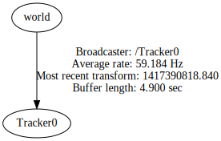

# Overview

This package is a fork of https://github.com/damanfb/ros_vrpn_client, which is a fork of the official ros_vrpn_client.
Its aim is to support ros_vrpn_client on ROS Indigo.

# Installation

1. Download VRPN from http://www.cs.unc.edu/Research/vrpn/. The instruction where tested with version 07.32.
2. Clone this repository to a ROS workspace
3. Run `export VRPN_ROOT=/path/where/your/vrpn/is`
4. Run `catkin_make`

# Testing your connection

1. Start a VRPN server. For example, you can use `vrpn_server` with the vrpn.cfg in the launch folder.
2. Run `roslaunch ros_vrpn_client test.launch` to listen to Tracker0@localhost and open rviz to visualize the transformation.
3. `rosrun tf view_frames && evince frames.pdf` should show Tracker0 with an update rate of 60 Hz, similar to the following image:

# Parameters:

* `ip`: The IP address or hostname of your VRPN server. [Default: `localhost`]
* `port`: The port number of your VRPN server. [Default: `3883`]
* `frame_id`: The parent of your transformation. [Default: `world`]
* `child_frame_id`: The name of your tracker object and the name of your new tf frame. [Default: `Tracker0`]
* `x, y, z, yaw, pitch, roll`: Additional coordinate transformation. [Default: `0, 0, 0, 0, 0, 0`]

# Notes

* Unlike the original package, this package does neither do any additional transformation nor has special handling for optitrack.
* The original package had some latency (up to one second) between a received vrpn message and publishing the transformation. This limitation has been removed.
